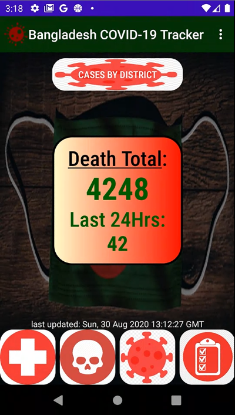
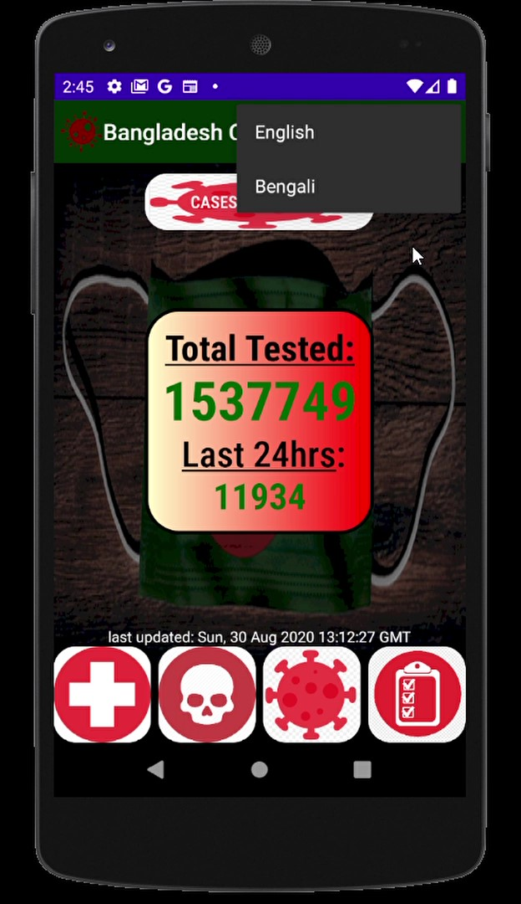

# Bangladesh Covid-19 Tracker
### Android and Mobile's First Coronavirus App implemented for Bengalis Worldwide...
Live National updates using the most sourceful Governement stats API to display Total death, recovered, positive cases, tested is Displayed along with - current cases of 67 Districts info compared to the previous day - which can be searched in a designed custom recyclerview in 2nd page- API feeds online updated data every 24 hours. 
Simple yet "First of its kind"...unique App written soley in KOTLIN using Android best practices, MVVM architecture, ViewModel, Retrofit for Network request, GSON parser/converter, Room persistence database for offline caching, RxJava, to name a few technologies used! 
   
UI was Desgined purely by me, along with the custom Logo, background, buttons, custom textview, recylerview,etc 
Written Soley to help Bengali and non-Bengalis not just in Bangladesh but UK, Middle East, Asia, USA, Canada..anywhere in the world. -- First Version...More Features will be added: Real time language, HeatMap to indicate hotspots, Redesigned UI, Push notifiations for being informed when your hometown cases rises, more details on press, stats graphs, todo list, and so forth
