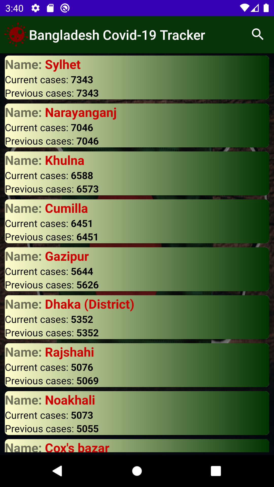
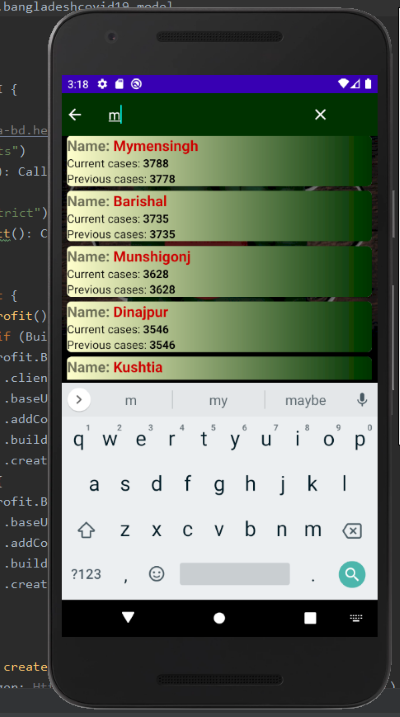

# Bangladesh Covid-19 Tracker
### Android and Mobile's First Coronavirus App implemented for Bengalis Worldwide...
Live National updates using an API build from the stats of official accredited government source to display Total death, recovered, positive cases, tested along with - current cases of each 67 Districts info compared to the previous day - which can be searched through a designed custom recyclerview in 2nd screen- API feeds online updates every 24 hours. 
Simple yet "First of its kind"...unique App written solely in KOTLIN using Android best practices, MVVM architecture, ViewModel, Retrofit for Network request, GSON parser/converter, Room persistence database for offline caching, RxJava and observable seqeunce, just to name few technologies used!  --Started on August 2020--

 

UI was Designed purely by me, along with the custom Logo, Background, buttons, custom textview, recylerview, etc 
Written Soley to help Bengali and non-Bengalis not just in Bangladesh but UK, Middle East, Asia, USA, Canada..all across the world. --First Version...More Features to be added: Real time language, HeatMap indicating hotspots, Redesigned UI with 1st screen info present, more details on Button press, Push notifications for being informed when your hometown case rises, stats graphs, todo list, so forth. *Part of code/API altered to avoid replication.

 
